# Mastra AI with Google Integration

A modular AI application built with Mastra framework, featuring Google AI integration, knowledge graph capabilities, and a focus on extensibility.

## Overview

This project implements a modular architecture for AI applications with a focus on maintainability, extensibility, and clean separation of concerns. Rather than implementing numerous features at once, this architecture establishes a solid foundation that can be incrementally enhanced over time.

## Features

- **Modular Agent Framework**: Core agent system with pluggable capabilities
- **Memory System**: Pluggable memory system with different storage backends (Upstash Redis)
- **Embedding System**: Flexible embedding providers (Xenova Transformers)
- **Knowledge Graph**: RAG and vector store components for knowledge integration
- **Google AI Integration**: Leverages Google's Gemini models for advanced reasoning
- **Voice Processing**: Optional voice input/output capabilities

## Directory Structure

```bash
project/
├── src/
│   ├── mastra/
│   │   ├── agents/             # Agent definitions and configurations
│   │   ├── memory/             # Memory system implementations
│   │   ├── tools/              # Tool implementations
│   │   ├── embeddings/         # Embedding models and utilities
│   │   ├── workflows/          # LangGraph workflows
│   │   ├── knowledge/          # Knowledge graph and RAG components
│   │   ├── voice/              # Voice processing components
│   │   ├── utils/              # Shared utilities
│   │   └── config/             # Configuration management
│   └── index.ts                # Main entry point
├── tests/                      # Test suite
├── .env                        # Environment variables
├── .env.example                # Environment variables example
├── README.md                   # Project documentation
└── CHANGELOG.md                # Version history
```

## Getting Started

### Prerequisites

- Node.js 18.x or higher
- Upstash account (for Redis and Vector DB)
- Google AI API key

### Installation

1. Clone the repository
   ```bash
   git clone https://github.com/yourusername/mastra-ai-google.git
   cd mastra-ai-google
   ```

2. Install dependencies
   ```bash
   npm install
   ```

3. Create a `.env` file based on `.env.example` and add your API keys
   ```bash
   cp .env.example .env
   # Edit .env with your API keys
   ```

4. Start the development server
   ```bash
   npm run dev
   ```

## Usage Examples

### Basic Agent Setup

```typescript
import { BaseAgent } from "./src/mastra/agents/baseAgent";
import { Memory } from "./src/mastra/memory/memory";

// Create memory
const memory = new Memory({
  provider: "upstash",
  options: {
    url: process.env.UPSTASH_REDIS_REST_URL,
    token: process.env.UPSTASH_REDIS_REST_TOKEN
  }
});

// Create agent
const agent = new BaseAgent({
  name: "BasicAgent",
  instructions: "You are a helpful assistant.",
  modelName: "gemini-2.5-pro-preview-05-06",
  memory
});

// Use agent
const response = await agent.stream("Hello, how can you help me?", {
  resourceId: "user_123",
  threadId: "conversation_1"
});
```

## Environment Configuration

Create a `.env` file in your project root with the following variables:

```
# LLM API
GOOGLE_GENERATIVE_AI_API_KEY=your-google-api-key

# Memory Storage
UPSTASH_REDIS_REST_URL=your-upstash-redis-url
UPSTASH_REDIS_REST_TOKEN=your-upstash-redis-token

# Vector Database
UPSTASH_VECTOR_REST_URL=your-upstash-vector-url
UPSTASH_VECTOR_REST_TOKEN=your-upstash-vector-token
```

## License

ISC

## Acknowledgments

- Mastra Framework
- Google AI
- Upstash
- Xenova Transformers

```mermaid
graph TD

    subgraph 7390["External Services & Platforms"]
        7421["Upstash Redis<br>Key-Value Store, SaaS"]
        7422["Upstash Vector DB<br>Vector Database, SaaS"]
        7423["Google Cloud AI Platform<br>LLM &amp; Embedding Services, SaaS"]
        7424["Langfuse Platform<br>LLM Observability, SaaS"]
    end
    subgraph 7391["Example Clients / SDK Usage"]
        7420["Agent Demo Script<br>TypeScript"]
    end
    subgraph 7392["Mastra AI System"]
        7401["Mastra Orchestrator<br>TypeScript"]
        7402["Core System Definitions<br>TypeScript"]
        subgraph 7393["Evaluation Subsystem"]
            7418["Evaluation Framework Core &amp; Types<br>TypeScript"]
            7419["Evaluation Metrics Suite<br>TypeScript"]
        end
        subgraph 7394["Observability Subsystem"]
            7416["Telemetry &amp; Logging Service<br>TypeScript, OpenTelemetry"]
            7417["Langfuse Adapter<br>TypeScript, Langfuse SDK"]
        end
        subgraph 7395["Knowledge & Embeddings Subsystem"]
            7412["Knowledge Store Logic &amp; Types<br>TypeScript"]
            7413["Upstash VectorDB Adapter<br>TypeScript, Upstash Vector Client"]
            7414["Embedding Service &amp; Types<br>TypeScript"]
            7415["Xenova Embedding Engine<br>TypeScript, Transformers.js"]
        end
        subgraph 7396["Memory Subsystem"]
            7409["Memory Core Logic &amp; Types<br>TypeScript"]
            7410["Upstash Memory Adapter<br>TypeScript, Redis Client"]
            7411["Memory Content Processors<br>TypeScript"]
        end
        subgraph 7397["Agent Subsystem"]
            7406["Base Agent Logic<br>TypeScript"]
            7407["Specialized Agent Implementations<br>TypeScript"]
            7408["Agent Configuration &amp; Types<br>TypeScript"]
        end
        subgraph 7398["Configuration Subsystem"]
            7403["System Configuration Loader<br>TypeScript"]
            7404["Model &amp; Provider Configuration<br>TypeScript"]
            7405["Agent Definition &amp; Behavior Config<br>TypeScript"]
        end
    end
    subgraph 7399["User Interaction"]
        7400["Developer / Integrator<br>External Actor"]
    end
    %% Edges at this level (grouped by source)
    7400["Developer / Integrator<br>External Actor"] -->|develops with / runs| 7420["Agent Demo Script<br>TypeScript"]
    7410["Upstash Memory Adapter<br>TypeScript, Redis Client"] -->|stores data in| 7421["Upstash Redis<br>Key-Value Store, SaaS"]
    7416["Telemetry &amp; Logging Service<br>TypeScript, OpenTelemetry"] -->|can log to| 7421["Upstash Redis<br>Key-Value Store, SaaS"]
    7417["Langfuse Adapter<br>TypeScript, Langfuse SDK"] -->|sends data to| 7424["Langfuse Platform<br>LLM Observability, SaaS"]
    7406["Base Agent Logic<br>TypeScript"] -->|interacts with LLM via| 7423["Google Cloud AI Platform<br>LLM &amp; Embedding Services, SaaS"]
    7404["Model &amp; Provider Configuration<br>TypeScript"] -->|defines connection to| 7423["Google Cloud AI Platform<br>LLM &amp; Embedding Services, SaaS"]
    7413["Upstash VectorDB Adapter<br>TypeScript, Upstash Vector Client"] -->|stores/retrieves vectors in| 7422["Upstash Vector DB<br>Vector Database, SaaS"]
    7414["Embedding Service &amp; Types<br>TypeScript"] -->|uses for Google embeddings| 7423["Google Cloud AI Platform<br>LLM &amp; Embedding Services, SaaS"]
    7418["Evaluation Framework Core &amp; Types<br>TypeScript"] -->|may use LLMs for evaluation via| 7423["Google Cloud AI Platform<br>LLM &amp; Embedding Services, SaaS"]
```

